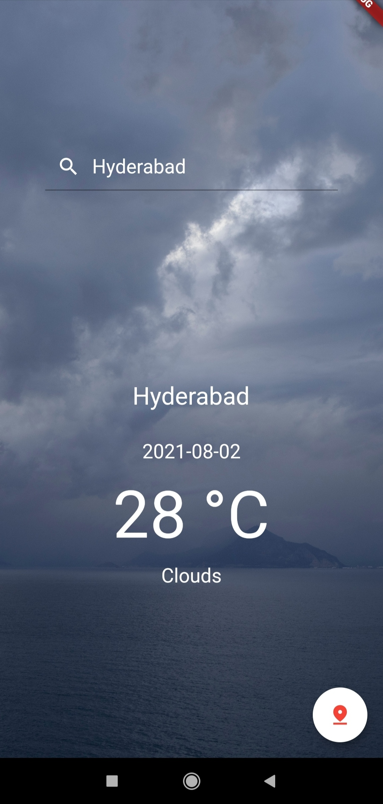
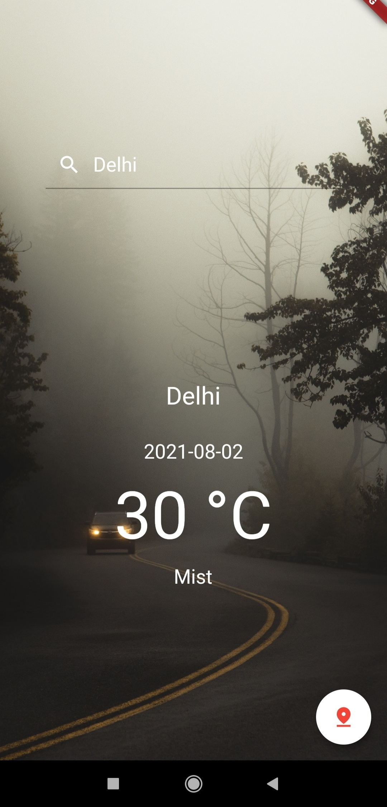
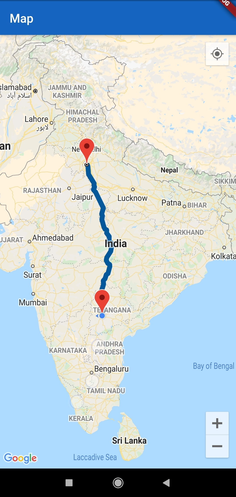

# Weather App

A mobile application(android and iOS) version of [meteo](https://weathersearchnow.netlify.app/) 
with an added map feature

Enter the city name and find out

- the temperature

- weather condition

- changes the background accordingly

- click on the map pin icon to find out a path from your current location to the city

  
   
   

Map from users current location to input city

